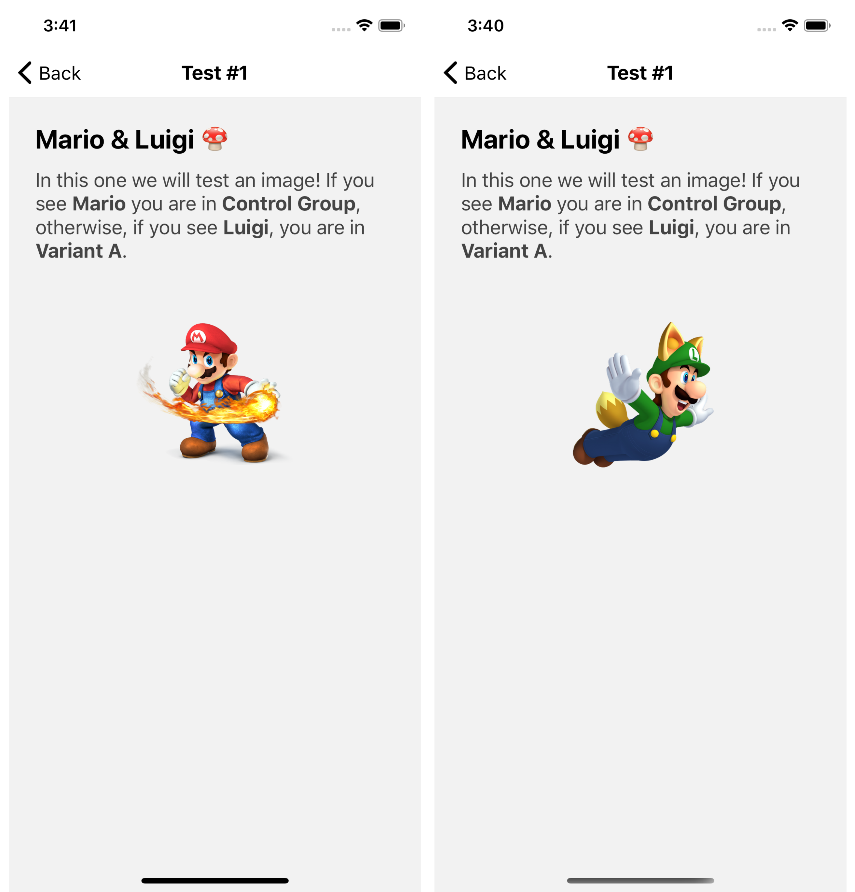

# A/B Testing Demo 🧪

This is a demo project to show the power of Firebase __A/B Testing__ and __Remote Config__ tools within __React Native__. 🔥⚛️

## Builded with:

* [React Native](https://reactnative.dev/)
* [React Native Firebase](https://invertase.io/oss/react-native-firebase/)
  - [Remote Config](https://invertase.io/oss/react-native-firebase/v6/remote-config)
* [React Navigation](https://reactnavigation.org/)
  - [Stack Navigator](https://reactnavigation.org/docs/stack-navigator/)
  
### Experiment #1 (Mario & Luigi):

In this one we will test an image! If you see __Mario__ you are in __Control Group__, otherwise, if you see __Luigi__, 
you are in __Variant A__.

 

 

### Experiment #2 (Button):

Ok, let's test more than two posibilities! Here you will see a button that opens a external website.
Variants are: __YouTube__, __InkedIn__, __Instagram__, __Medium__ and __GitHub__.

 

 

### Experiment #3 (Color / Text):

Excellent! Finally, let's try another way, let's use directly the value from __Remote Config__. 
Here you will se a rectangle with the color and text that cames from Firebase.

 

 
